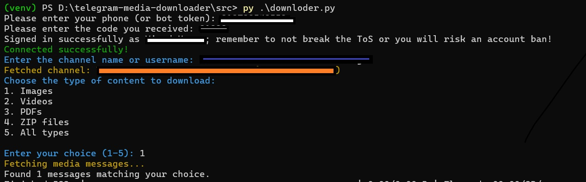
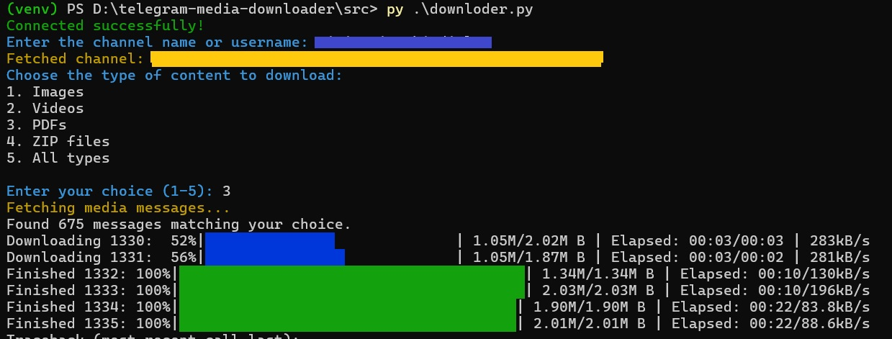

# Telegram Batch Media Downloader

Telegram Batch Media Downloader is a fork of [Telegram Bulk Media Downloader](https://github.com/vinodkr494/telegram-media-downloader), a Python-based tool that allows users to download various types of media files (videos, images, PDFs, ZIPs, etc.) from Telegram channels and groups. The downloader supports resumable downloads, batch processing, and progress tracking, making it ideal for managing large volumes of media efficiently.

## Features

-   **Batch Processing**: Downloads media in configurable batches for better resource management.
-   :new: **Use Chat_ID instead of chat/group name**: Automatically converts the Chat_ID number to the chat/group name. 
-   **Multi-Media Support**: Supports videos, images, PDFs, ZIP files, and more.
-   :new: **File Autorenaming**: When a file e.g. a video is embedded (i.e. directly playable) from a chat, it uses the accompanying text as filename of the saved file.
-   **Progress Tracking**: Displays detailed progress bars for each download.
-   **Configurable Settings**: Easily customizable batch size and session settings via `.env` file.
-   **Cross-Platform**: Runs on Windows, macOS, and Linux.
-   **Lightweight**: Requires only Python and a few libraries to run.

## Screenshots

Here are some screenshots demonstrating the tool in action:



## Requirements

-   Python 3.8+
-   Telegram API credentials (API ID and API Hash)

## Installation

1. Clone the repository:

    ```bash
    git clone https://github.com/mdic/telegram-batch-media-downloader
    cd telegram-batch-media-downloader
    ```

2. Install dependencies:

    ```bash
    pip install -r requirements.txt
    ```

3. Create a `.env` file and configure it:

    ```env
    API_ID=your_api_id
    API_HASH=your_api_hash
    SESSION_NAME=default_session
    BATCH_SIZE=5
    ```

4. Run the script:
    ```bash
    python src/tbmd.py
    ```

## Usage

1. **Start the script**:

    ```bash
    python src/tbmd.py
    ```

2. Enter the Telegram channel username or group link when prompted.

3. Select the type of media to download (e.g., videos, images, PDFs).

4. Watch as your files are downloaded with detailed progress bars!

## Advanced Configuration

### Resuming Downloads

The downloader automatically saves the progress of completed files in a `download_state.json` file. To resume downloads, simply restart the script, and it will skip already downloaded files.

### Batch Size

To adjust the number of files downloaded in parallel, update the `BATCH_SIZE` value in the `.env` file.

### Supported Media Types

The tool supports the following media types:

-   Videos
-   Images
-   PDFs
-   ZIP files
-   Any other Telegram media

## License

This project is licensed under GPLv3 License. See the [LICENSE](LICENSE) file for details.

## Acknowledgments

-   [Vinod Kumar](https://github.com/vinodkr494) for the original code :pray:.
-   [Telethon](https://github.com/LonamiWebs/Telethon) - For making Telegram API integration easy.
-   [TQDM](https://github.com/tqdm/tqdm) - For elegant progress bars.
-   [Colorama](https://github.com/tartley/colorama) - For colorful console output.

---

Made with ❤️ by [Vinod Kumar](https://github.com/vinodkr494) and edited with equal :heart: by [Matteo Di Cristofaro](https://github.com/mdic) .
